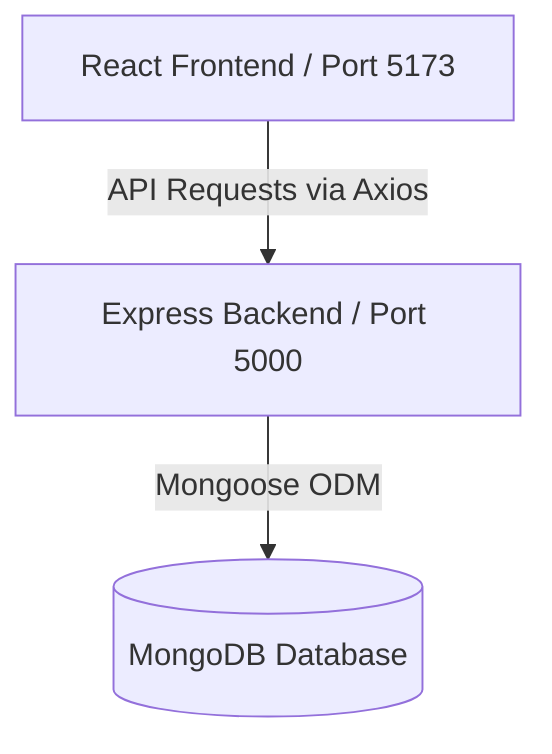

# College Attendance Management System

A premium, dynamic web-based **Attendance Management System** designed for colleges and universities. The application features full role-based access control (RBAC) with three distinct portals: **Admin**, **Teacher**, and **Student**. 

---

## 🏗️ Architecture Overview

The project is structured as a decoupled **Client-Server** web application:



### 1. Backend Architecture (Express Server)
The backend follows the **MVC (Model-View-Controller)** pattern:
* **Models**: Schemas defined using Mongoose for `User`, `Student`, `Teacher`, `Class`, `Subject`, `Department`, and `Attendance` records. Incorporates compound database indexes to guarantee rapid aggregations.
* **Controllers**: Handles core business logic, statistical dashboard calculation, dynamic CSV generation, and authentication.
* **Routes**: Modular route handlers for Admin, Teacher, Student, and Report features. Protected by JSON Web Token (JWT) middleware.
* **Middleware**: Includes JWT signature verification (`auth.js`) and role validator (`roleCheck.js`) to restrict endpoints according to roles.

### 2. Frontend Architecture (React Client)
The frontend client uses modern single-page application (SPA) patterns:
* **Vite**: Ultra-fast build tool and bundler.
* **React Context API**: Implements `AuthContext` to maintain authentication states, JWT tokens, and user metadata throughout the application sessions.
* **React Router v6**: Implements layout routing and role-guarded routing (`ProtectedRoute.jsx`) to enforce client-side access control.
* **Recharts**: Renders rich data charts mapping weekly, monthly, and subject-wise attendance statistics.
* **Tailwind CSS**: Sleek glassmorphism styles, dark mode aesthetics, and micro-interactions.

---

## 🛠️ Technology Stack

* **Frontend**: React (v18), Vite, React Router DOM, Axios, Tailwind CSS, Recharts, React Icons, React Hot Toast
* **Backend**: Node.js, Express, MongoDB, Mongoose, JSON Web Token (JWT), BcryptJS

---

## 🚀 Setup & Installation

### Prerequisites
* [Node.js](https://nodejs.org/) installed (v16+ recommended).
* [MongoDB](https://www.mongodb.com/) running locally on port `27017` (or access to a MongoDB Atlas cluster).

### Step-by-Step Installation

1. **Clone the Repository**
   ```bash
   git clone <repository-url>
   cd attendance
   ```

2. **Configure Environment Variables**
   Create a `.env` file inside the `server` directory:
   ```bash
   # Create server/.env
   PORT=5000
   MONGODB_URI=mongodb://localhost:27017/attendance_db
   JWT_SECRET=attendance_jwt_secret_key_2024
   ```

3. **Install Dependencies**
   Install packages for both the server and client:
   ```bash
   # Install Server dependencies
   cd server
   npm install

   # Install Client dependencies
   cd ../client
   npm install
   ```

4. **Seed Database**
   Initialize the database with default departments, subjects, students, teachers, and logs:
   ```bash
   cd ../server
   npm run seed
   ```

---

## 💻 Running the Application

For a fully working environment, run both servers in parallel:

### 1. Start the Backend API Server
```bash
cd server
npm run dev
```
* Runs by default on **http://localhost:5000**
* Health check: [http://localhost:5000/api/health](http://localhost:5000/api/health)

### 2. Start the Frontend Dev Server
```bash
cd client
npm run dev
```
* Runs by default on **http://localhost:5173**

---

## 🔑 Demo Login Credentials

You can log in to the application using these seeded accounts:

| Portal | Email | Password | Assigned Permissions / Role |
| :--- | :--- | :--- | :--- |
| **Admin Panel** | `admin@college.edu` | `admin123` | System configuration, creating/editing teachers, subjects, classes, students, and downloading overall CSV reports. |
| **Teacher Portal** | `sarah@college.edu` | `teacher123` | Marking class attendance, viewing low-attendance warning flags, checking histories, and editing past class logs. |
| **Student Portal** | `john@student.edu` | `student123` | Viewing personal profile, overall attendance rate, subject breakdowns, and downloading individual reports. |

---

## 🧪 Database Reset & Testing Scripts

Inside the `server/utils/` directory, several helper scripts are provided:

* **Clear All Attendance History** (Keep structure, reset scores):
  ```bash
  cd server
  node utils/clearAttendance.js
  ```
* **Wipe Entire DB Except Admin** (For manual setup testing):
  ```bash
  cd server
  node utils/clearAllExceptAdmin.js
  ```
* **Seed Diverse Test Scenarios**:
  ```bash
  cd server
  node utils/testVariousData.js
  ```
